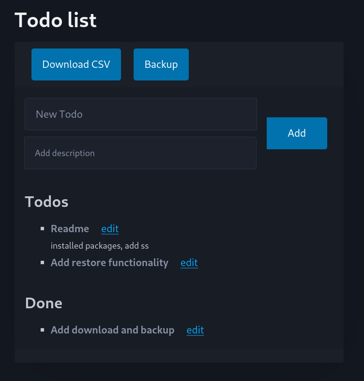

This repo is a todo list website which uses fasthtml, a python package which helps us to implement websites. This was done by us to better understand how fasthtml works.

## Required packages
1. pip install python-fasthtml
2. pip install fastapi

## Features
- Add, edit, and delete TODO items  
- Mark items as done  
- Backup and download data as CSV
- Restore data

